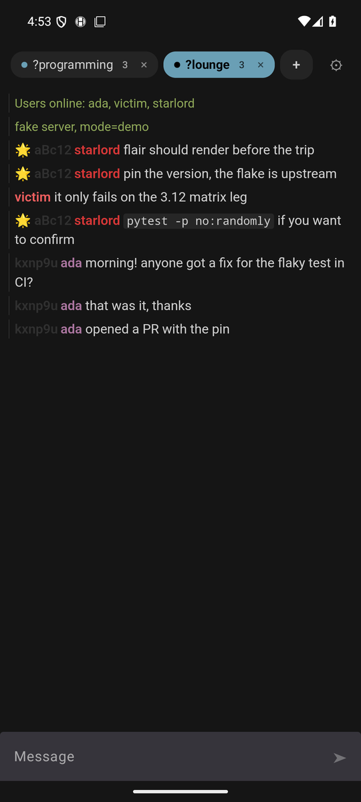
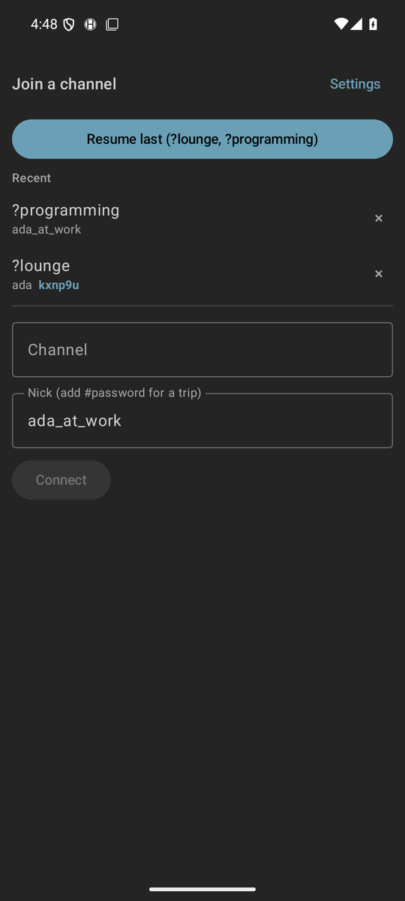
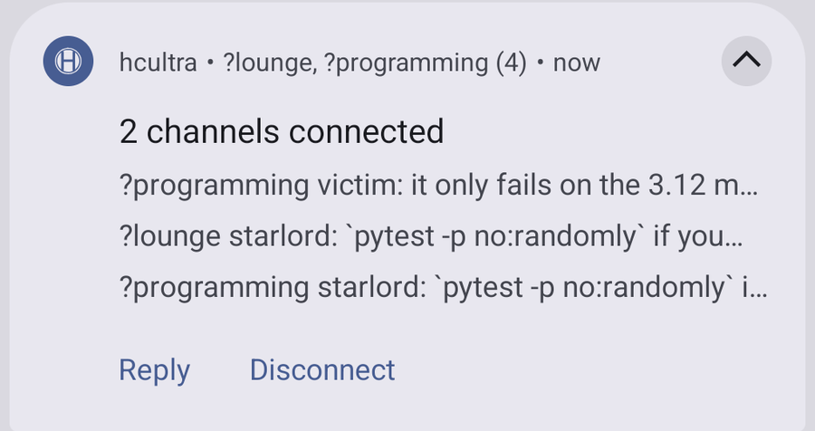

<div align="center">

# hcultra

**An Android client for [hack.chat](https://hack.chat) that stays connected.**

[](https://github.com/MinusGix/hcultra/actions/workflows/ci.yml)
[](https://github.com/MinusGix/hcultra/releases/latest)

</div>

hack.chat in a mobile browser drops you out of the conversation the moment you
switch apps — phone browsers kill background WebSockets. That matters more here
than it would elsewhere, because the server keeps **no history**: whatever was
said while you were gone is simply gone, and every reconnect shows up to the
whole channel as you leaving and rejoining.

hcultra holds the connection in a foreground service, so it doesn't happen.

<div align="center">

&nbsp;&nbsp;

</div>

## Install

Grab the APK from the [latest release](https://github.com/MinusGix/hcultra/releases/latest)
and open it on your phone. Android will ask you to allow installs from your
browser or file manager the first time. Needs Android 8 or newer.

Every APK is built by GitHub Actions straight from this repository — never
uploaded by hand — and carries a signed attestation saying so:

```sh
gh attestation verify hcultra-*.apk --repo MinusGix/hcultra
```

## What it does

- **Stays connected in the background.** A foreground service owns the socket,
  so backgrounding the app, rotating, or getting killed and restarted doesn't
  cost you the conversation.
- **Several channels at once**, as tabs, each with its own unread count and
  connection state.
- **Remembers who you were, per channel.** People use different nicks in
  different rooms, so hcultra stores the pair, along with the tripcode password.
  One tap reconnects as that person; "Resume last" reopens every tab you had.
- **Renders like the site.** The same markdown, KaTeX and syntax highlighting,
  and all 44 of hack.chat's colour schemes.
- **Reply from the notification**, which also shows the last few messages — so
  you can check whether anything happened without opening the app.

<div align="center">

</div>

- **Whispers, the user list, and moderation** — kick, ban, muzzle — with each
  action offered only when the server would actually accept it.
- **Point it at another server** if you run your own hack.chat.

### Not there yet

- Messages typed while reconnecting can't be sent — the composer is disabled
  until the connection is back, rather than queueing them.
- No iOS. The core is shared Kotlin and would port, but iOS cannot hold a
  background socket at all, which removes most of the reason this exists.

## Building it yourself

Needs JDK 21 and an Android SDK with platform 37.1.

```sh
./gradlew :core:jvmTest              # protocol tests, no network
./gradlew :app-android:assembleDebug # APK in app-android/build/outputs/apk/debug/
```

`docs/releasing.md` covers signing and how a release is cut.

## For contributors

| | |
|---|---|
| `core/` | Kotlin Multiplatform protocol core — frames, session state machine, rate governor, message buffers |
| `app-android/` | The app: foreground service, notification, Compose UI, WebView renderer |
| `probe/` | A harness that explores the live protocol, plus `fakeserver.mjs` — a deliberately misbehaving server for the paths the real one won't produce on demand |
| `docs/` | Design notes, the Android-specific traps, and the upstream asks for hack.chat |

**Read [`probe/FINDINGS.md`](probe/FINDINGS.md) first.** hack.chat's protocol has
sharp edges that this code is shaped around, and that file is the reference for
why. A few that bite hardest:

- The **first frame you send picks the dialect for that socket's entire life**.
  `session` selects v2; `join` first permanently downgrades you to the 2015-era
  protocol where whispers arrive as prose.
- The **session token arrives *after* `onlineSet`**. Treat `onlineSet` as
  "handshake done" and you never capture one.
- A token **is an identity** — presenting one overrides the nick you asked to
  join as, which is why tokens are keyed by identity as well as channel.
- `customId` is capped at **6 characters**; longer and the server drops your
  message with no reply *and* charges you rate-limit points.
- **One channel per socket.** Rate limiting is scored per *address*, so all of
  them share one budget.

Findings were established against upstream `7435d0a` and live hack.chat
**2.2.3b**; the two diverge. `hc/` in this tree is a gitignored clone of the
[server source](https://github.com/hack-chat/main), kept as a reference:

```sh
git clone https://github.com/hack-chat/main hc
```

`docs/android-notes.md` has the emulator setup and the toolchain traps.

## Credits

hack.chat is by [Andrew Belt and contributors](https://github.com/hack-chat/main)
and is MIT licensed; the colour schemes, the renderer's markup and the app icon
come from it. This is an unofficial client and is not affiliated with or
endorsed by hack.chat.
